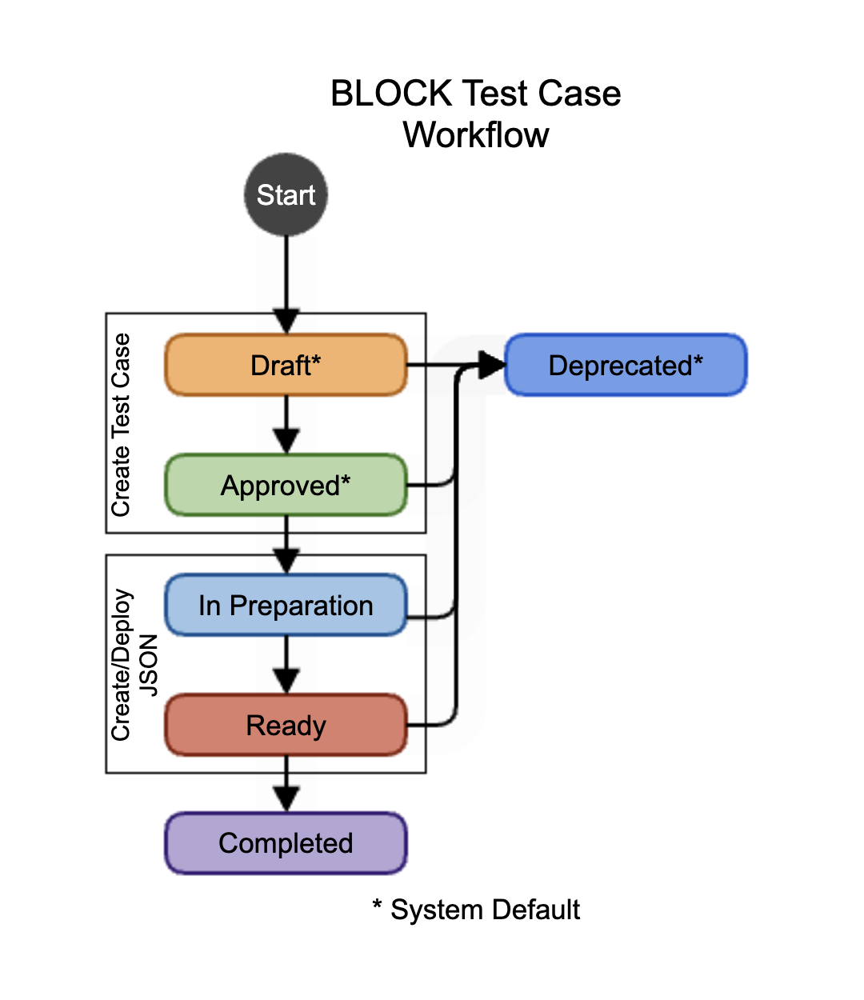

# Observing Task Management Workflow Summary

```{eval-rst}
.. abstract::

   This proposal outlines how observing tasks will be flowed from the planning stage through execution, then linked to data analysis technotes and/or notebooks.
```

:::{note}
This technote outlines how observing tasks are currently flowed from the planning stage through execution, then linked to data analysis technotes and/or notebooks.
:::


# Introduction

(add an introduction here)

All the tests we run start with an idea, a requirement, a problem to be investigated and follow four big steps:

* Creation
* Planning
* Execution
* Analysis

<!-- TODO - Convert this diagram in to a more controlled format -->
Each of these steps has its workflow, which is represented in the [Test Workflows Whiteboard in Confluence](https://rubinobs.atlassian.net/wiki/spaces/LSSTCOM/whiteboard/491618342).

While Jira provides the general infrastructure for issue tracking and project management, Zephyr Scale is a test management plugin that integrates seamlessly with Jira.
Jira handles tasks like bug tracking, planning, and organizing work via tickets (e.g., BLOCK-000), whereas Zephyr Scale adds dedicated features for defining test cases, organizing test cycles, tracking execution status, and reporting on test coverage and results.

In practice, Jira is where the request and coordination happen, and Zephyr Scale is where the structured test definitions and execution history live.
This separation helps us coordinate testing work efficiently while also enabling traceability between test cases, their executions, and the broader goals captured in Jira tickets and epics.

It is important that the reader understands the differences between these two tools before moving forward.
In addition, the reader must be aware of the different keys used in both systems:

* `BLOCK-000`: A standard Jira ticket in the BLOCK project, typically used for task tracking, coordination, or as a placeholder for test creation.

* `BLOCK-T000`: A Zephyr Scale test case in the BLOCK project, defining a set of steps, inputs, and expected outcomes for a specific test.
They tests that we want to execute at the summit.
They can be a verification test, characterization test, minimum functionality test, etc.
Less frequently, the test cases will represent standard procedures like [AuxTel Daytime Checkouts](https://rubinobs.atlassian.net/projects/BLOCK?selectedItem=com.atlassian.plugins.atlassian-connect-plugin:com.kanoah.test-manager__main-project-page#!/testCase/BLOCK-T17).

* `BLOCK-R000`: A Zephyr Scale test cycle which represent the plan to be executed on a particular date (either during the day or during the night).
Right now, each test cycle should be named YYYY-MM-DD Night Plan.
The term "night" might be misleading, and we probably need to review it.
However, the name itself should follow a standard to ensure compatibility with the new LOVE Test Player that is under development.

* `BLOCK-E000`: A Zephyr Scale test execution, representing the result of running a specific test case (T000) within a given test cycle (R000).

* `BLOCK-P000`: A Zephyr Scale test plan, which can include multiple test cycles (R000) and provides a higher-level view of testing coverage and progress.


# Test Creation

Our entry point for converting tests and ideas into Test Cases and JSON Blocks is the #sitcom-observing-block channel. As described in that Slack channel’s canvas, the process we use to receive requests to create or update Test Cases or JSON Blocks consists of the following steps:

1. Create a BLOCK or SITCOM ticket with the `test_case` label.  

2. The title of the ticket should be consistent with what is being requested.  
   Here are a few examples:  

   1. "Create test case for ..."
   2. "Create test case and JSON file for ..."
   3. "Update test case for ..."
   4. "Update JSON file for ..."

<!-- TODO: Convert Labels into a link -->
3. Add extra labels to help filter the board.
   See a few example of labels in the Labels section below.

4. In the ticket description, make sure you add:
   1. Test goal
   2. The pre-conditions
   3. The steps needed

<!-- TODO: Convert Priorities into a link -->
5. Define the priority for writing down this test.
   See the **Priorities** session for more details.

You can use the Test Create Priorities to define the ticket priority.


## Labels

Labels are used to quickly find tickets, create queries, boards, and dashboards.
The labels here should all be lower case and words separated by a underscore (`_`).
Please, avoid creating labels that can be de-coupled into two other labels.
For example: instead of `lsstcam_science`, use `lsstcam` and `science`.
Or, even better, just use `science`, since `lsstcam` is the default camera.

| **Label**             | **Description**                                                                      |
|-----------------------|--------------------------------------------------------------------------------------|
| `create`              | Used for the creation of a test case or JSON file.                                   |
| `update`              | Used for updating a test case or JSON file.                                          |
| `json_block`          | Used when a JSON file is required.                                                   |
| `on_sky/not_on_sky`   | Used for on-sky or not-on-sky tests.                                                 |
| `daytime_test`        | Used for tests that could be performed during the daytime.                           |
| `parallelize`         | Used for tests that have potential for being parallelized.                           |
|                       |                                                                                      |
| `aos_commissioning`   | Used for tests associated with the Active Optics System                              |
| `LSSTCam`             | Used for tests aiming to check functionality of requirements associated with LSSTCam |
| `calibration`         | Used for tests related to the calibration system                                     |
| `image_quality`       | Used for tests associated with image quality.                                        |
| `science`             | Used for Science Observations programs                                               |
| `stray_light`         | Used for tests associated with stray light investigations.                           |
| `standard_procedures` | Used for procedures that are represented as test cases.                              |

Each row in the second part of the table above corresponds to a Quick Filter in the [Blocks Creation Status](https://rubinobs.atlassian.net/jira/software/c/projects/BLOCK/boards/259) board.


## Priorities

Each of these steps has a definition of priority.
This section focuses on the priorities when it comes to creating or updating test cases and json files.

**Critical** - Safety-related test cases or JSON files.  
They are expected to be ready in less than 24 hours after the ticket is created in the LSSTCam campaign.  
Example: power on the camera and take image.  

**High** - Any test case or JSON file that blocks progress in other tests, affecting critical path.  
They are expected to be ready within 48 hours after the ticket is created in the LSSTCam campaign.  
Example: pointing model verification.  

**Medium** - Daily routines or tests to improve the system’s performance.  
They are expected to be ready within a week after the ticket is created in the LSSTCam campaign.  
Examples: System checkouts. M1M3 gateway tests.  

**Low** - Nice to have tests.  
They should be created when possible, hopefully within two weeks after ticket creation.  
Examples: shutter sync.  


## Statuses

There are two places where we use statuses as indicator of work progress.
One in the test cases and one in their associated Jira tickets.
Please, see a summary of both below.


### Jira Tickets Statuses

We have been using both SITCOM and BLOCK tickets as possible projects to request new test cases.
Each project has their own workflow.
Because of that, we truly rely more on the Test Cases statuses than in the Jira tickets statuses.


### Test Cases Statuses

The diagram belows represents the full status cycle of a test case.



The workflow for creating tests have two phases:

1. Create the test case itself - Represented by the `Draft` and `Approved` statuses.
2. Create the JSON file(s) to execute the test case - Represented by the `In Preparation` and `Ready` statuses.


#### Draft

This is a System's Default status and cannot be modified.
Originally, we would like to have a Proposed status.
Since `Draft` status is a system default, we will use it to replace `Proposed` status.

It is where someone starts drafting the test case.
It can start with a high-level test case description and slowly be filled up.
The test case will remain in this state until we have the following criteria met:

* A high-level description with context and information for people unfamiliar with the test to understand the overall procedure and goals

* The steps filled up. 
We want to keep the number of steps below five and have a hard cut of 10 steps. 
Except for cases where the same step is repeated with different parameters (as it happened during OR4, see BLOCK-T57 (1.0))

* Any external resources should be linked to the test case in the `Traceability` tab. 
This includes confluence pages, SITCOM tickets for data analysis, OBS tickets for eventual known issues, LVV tickets containing requirements, and links to associated JSON files. 


#### Deprecated (System's Default)

This is a System's Default status and cannot be modified.
This should be equivalent to an Invalid or Rejected status.

Whenever we want a test case not to be used (anymore), we transition it to Deprecaded. 
We should write the reason for this transition in the Comments tab.


#### Approved (System's Default)

This is a System's Default status and cannot be modified.

The Approved status represents a test case with the minimum information needed to create any required BLOCK JSON.
We transition the test case to the In Preparation status when working on JSON files. 

If the test case does not require JSON files and contains all the information needed to be executed, we can transition it to the Ready status instead.

#### In Preparation

Once a test case is approved, we will start working on the BLOCK JSON file and completing any missing information.
This is when testing at the test stands should take place.


#### Ready

The Ready status represents a test case ready to be executed at the summit. This means that:

* It contains all the required information needed to be executed

* This included a high-level description of the test containing the goal, the steps (pseudo-code), the success criteria, and possible failure mitigation strategies. We also want to add the required data analysis depending on the test case. 

* Links to external resources like the BLOCK Json files, Confluence Pages with discussions, Jira tickets with known issues, data analysis, or the ticket used to create the associated test case.

* Each step in the Test Script should have a highlighted goal in a single sentence. Use bold and orange letters for highlight.

* The proper fields for each step that requires a SAL Script should contain the script name and the script YAML configuration.

* The JSON file(s) associated with this test case is complete and deployed at the summit.


#### Completed

The Complete status is used for tests that probably will not be executed anymore (or soon).
This status may represent a successful verification test and can be used for traceability and reporting.


# Test Planning

Generally speaking, tests are usually coordinated in the #sitcom-test-planning Slack channel.
Someone (TODO - update this!) will start a thread in that channel every day.
Requests for tests should live inside that thread.

Tests that might affect daytime activities must be requested as SUMMIT tickets.
These tickets must be configured with:
1. A descriptive title
2. A short description including who is expected to support this test and which systems will be used.
3. `SITCOM` in the `Discipline` field.
4. A suggested `Start Data` and `End Date`.
5. Links to associated test cases.

These tests must be coordinated with the day crew and this ticket helps coordination.


# Test Execution

(add text)


# Test Analysis
(add text)
